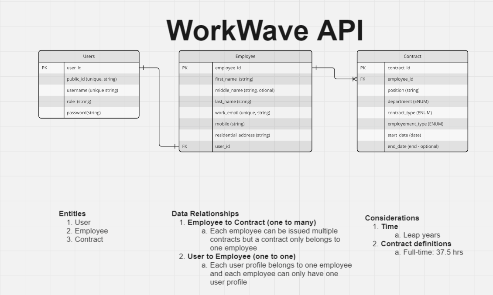
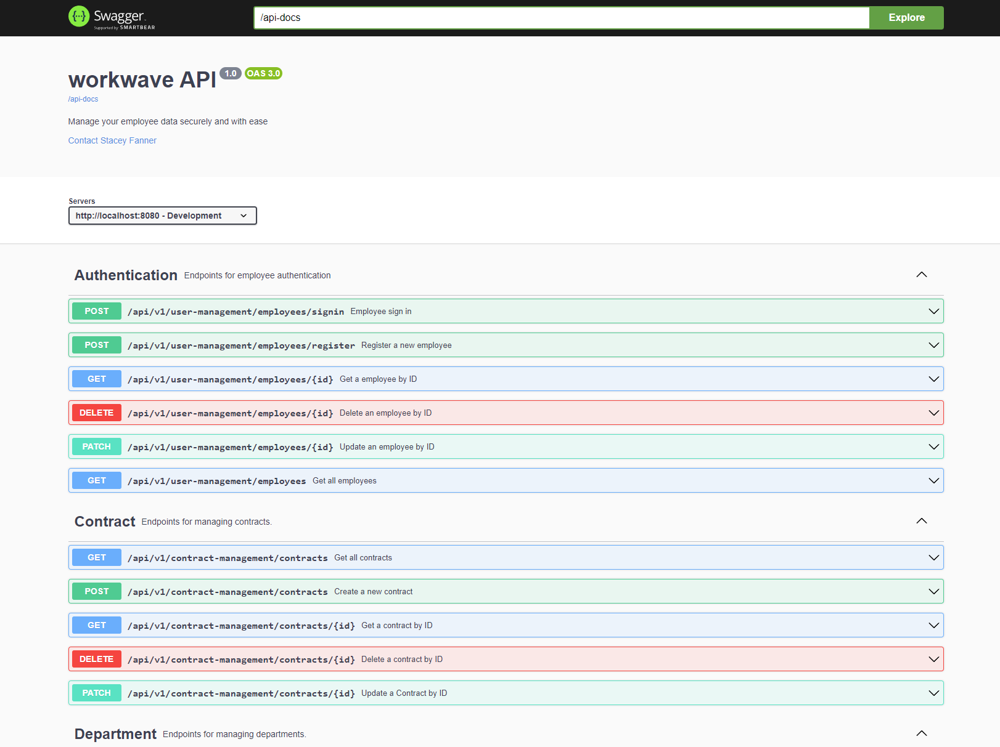

# WorkWave-backend

A full stack Spring boot app designed to help you manage your employees with ease.

## The Brief

In this fictional brief, I have been task to build a full stake employee management tool with the following requirements:
- We need a web application to create, list, modify and delete employees. The application should consist of a spring RESTful API and a React Typescript frontend. The schema for the employee is left to the criteria of the candidate.

React hints:

- React Redux is recommended.
- Typescript is recommended.
- React hooks are recommended.
- Add some basic validations on the form like required and max length validations.
- The site should be responsive.

RESTful API hints:

- The list can be a local database, CSV, TXT file or even in memory
- Implementing an API logging strategy.
- Implementing error handling strategy.

At least 3 endpoints are required:

- To create an employee
- To get a list of existing employees
- To delete an employee

<!-- ## Demo

This API works hand in hand with the Typescript React app (available [here](https://github.com/staceyjf/Postcheck-front)) which is being demo'ed below.

<div align="center">
  
</div>

## Deployment

1. Flask Gunicorn server: Deployed via Azure Web Apps using a Docker container registered in Azure Container Registry (ACR).
2. MySQL Cloud DB: Aiven -->

## Build Steps

```bash
1. git clone https://github.com/staceyjf/WorkWave-backend
2. cd WorkWave-backend 
3. mvn -B package --file pom.xml
4. Add your credential in a .env to connect to a postgres database. An example env configure can be found at `.env.example`
5. mvn spring-boot:run
6. Run tests: `mvn --batch-mode --update-snapshots verify`
```

## Planning considerations

### ERD

Understanding the relationship of the data was an important starting point, and I determined that a normalized data structure would be the most suitable approach to minimize redundancy and dependency. 

Steps taken:
1. Reviewed the fields required for authentication and how they could be overlaid with employee information to create a streamlined user-based `Employee` entity.
2. Separated out the work-specific details of the role into a `Contract` entity to hold items such as contract type (contract vs. permanent) and employment type (part-time vs. full-time)..

<div align="center">
  
</div>

### Business assumptions
1. Full-time permanent employees can only have one contract at a time (unless the end date is set before the start date of a new contract).
2. Full-time contracting employees can only start a new contract once the existing contract has expired.
3. The minimum length of a contract needs to be one calendar day.

<!-- ### Design inspiration

I took inspiration from the existing Aus-Post service to help shape my design which can be seen below:

<div align="center">
  
</div> -->

### Design choices

1. **Adopting the Controller-Service-Repository Pattern:** This layered architecture approach ensured clear separation of concerns, leadings to better organized and more maintainable code. 

2. **Authentication:** Extended existing learning by implementing a cookie-based JWT instead of using the Response Authorization header.

3. **Manual approach to validation and model mapping:** Chose to manually handle model mapping and validation in the service layer to gain a deeper understanding of serialization/deserialization and implement a comprehensive error strategy with custom error messaging.

<!-- which manifested into a flow of data via the following layers:

<div align="center">
  
</div> -->

## Key Features:

### Back-end

#### The '70':

1. **CRUD API Endpoints**: Developed comprehensive RESTful CRUD (Create, Read, Update, Delete) endpoints for managing Departments, Employees and Contracts. 

2. **API documentation:** Integrated Swagger for clear, interactive API documentation, making it easier to understand and consume the API.

3. **Logging:** Added Log4J logger and a file-based logging strategy, improving the traceability and debugging of server-side errors.

4. **CI/CD Pipeline:** Implemented a development workflow with GitHub Actions to ensure code passes the test suite before being added to the main branch.

#### The '20':

1. **Authentication:** : Utilized Jakarta Java Cookie to attach and retrieve the JWT.

2. **Lombok Integration:** Integrated the Lombok library to reduce boilerplate code.

#### The '10':

1. **Basic Integration Testing:**  Testing: Full integration testing with JUnit5 and Rest Assured for Authentication (Register and Sign In) and Employee Entity (CRUD).

## Key Learning Highlights

1. **Spring boot tooling:** Gained deep insights into the various tools and libraries within the Spring Boot ecosystem.

## To-Dos

1. **Response loading strategy:** Implement pagination and explore alternative strategies (e.g., lazy loading) for optimizing data delivery in reporting features.
2. **Testing:** Expand integration testing to include Departments and Contract entities.
3. **Querying:** Expand functionality to include the ability to query employees based on contract status or employment status.

## Changelog


## Documentation

Explore the spring API documentation at: `http://localhost:8080/swagger-ui/index.html`

<div align="center">
  
</div>

## Technologies Used

<div align="center">


<!--  -->


</div>
