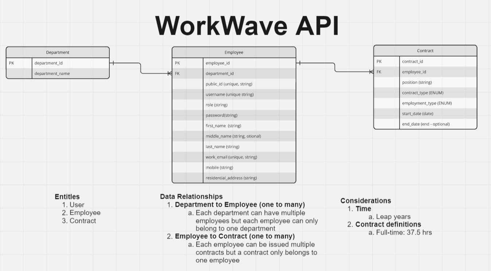

# WorkWave-backend

A full stack Spring boot app designed to help you manage your employees with ease

## The Brief

In this fictional brief, I have been task to build a full stake employee management tool with the following requirements:
We need a web application to create, list, modify and delete employees. The application should consist of a spring RESTful API and a React Typescript frontend. The schema for the employee is left to the criteria of the candidate.

React hints:

- React Redux is recommended.
- Typescript is recommended.
- React hooks are recommended.
- Add some basic validations on the form like required and max length validations.
- The site should be responsive.

RESTful API hints:

- The list can be a local database, CSV, TXT file or even in memory
- Implementing an API logging strategy.
- Implementing error handling strategy.

At least 3 endpoints are required:

- To create an employee
- To get a list of existing employees
- To delete an employee

Explore the spring API documentation at: http://localhost:8080/swagger-ui/index.html

<!-- ## Demo

This API works hand in hand with the Typescript React app (available [here](https://github.com/staceyjf/Postcheck-front)) which is being demo'ed below.

<div align="center">
  
</div>

## Deployment

1. Flask Gunicorn server: Deployed via Azure Web Apps using a Docker container registered in Azure Container Registry (ACR).
2. MySQL Cloud DB: Aiven -->

## Build Steps

```bash
1. Clone the repo.
2. Cd into `WorkWave-backend` folder
3. Start the Spring Boot backend via `WorkWaveApplication.java`
4. Test suit can be run via `app/src/test` folder
```

## Planning considerations

### ERD

Understanding the relationship of the data was an important starting point, and it was determined that a normalized data structure would be the most suitable approach to minimize redundancy and dependency. I took the following steps:

1. Reviewed the fields required for authentication and how they could be overlaid with employee information to create a streamlined user based `Employee` entity
2. Separated out the work-specific details of the role into an `Contract` Entity to hold items such as contract type (contract vs. permanent) and employment type (part-time vs. full-time).

<div align="center">
  
</div>

### Business assumptions
1. Full-time permanent employees can only have one contract at a time (unless the end date is set before the start date of a new contract)
2. Full-time contracting employees can only start a new contract once the existing contract has expired.
3. The minimum length of a contract needs to be one calendar day

<!-- ### Design inspiration

I took inspiration from the existing Aus-Post service to help shape my design which can be seen below:

<div align="center">
  
</div> -->

<!-- ### Design choices

1. **RESTful API Design:** Felt like a natural git given its wide spread adoption, compatibility and simplicity (leveraging std HTTP methods to interact with resources).

2. **Adopting the Controller-Service-Repository Pattern:** This layered architecture approach ensured clear separation of concerns, leadings to better organized and more maintainable code.

3. **Modular Services Architecture:** The use of factory functions in the create_app() and utilizing Flask-Smorest's blueprints enabled the API to be designed into loosely coupled components where each service is focused on a specific entities (Postcodes, Suburbs, Users and Reporting).

4. **Authentication:** Following a discussion with my \_nology coach, we agreed that JWT implemented via including the token in the Authorization header of HTTP requests. The server validates this token and determines the response based on its validity.

which manifested into a flow of data via the following layers:

<div align="center">
  
</div>

## Key Features:

### Back-end

#### The '70':

1. **CRUD API Endpoints**: Developed comprehensive RESTful CRUD (Create, Read, Update, Delete) endpoints for managing Postcodes and Suburbs. This includes the capability to query postcodes by suburb name

2. **API documentation:** Integrated Swagger for clear, interactive API documentation, making it easier to understand and consume the API.

3. **Logging:** Adopted Python's built-in logging module via Flask for basic console-level logging, providing insights into the application's operational status and aiding in troubleshooting.

4. **Database Management:**

   - Employed Alembic via Flask Migrate to maintain the integrity of the data by keeping track and implementing changes to the db's schema through migration scripts.
   - Used SQLAlchemy as the ORM to define and generate the schema.

5. **Response Validation:** Implemented response validation with Marshmallow to reduce errors arising from unexpected request bodies and enhance developer experience by ensuring consistent and validated responses.

6. **Serialization/Deserialization:** Utilized Flask-Smorest to automate the serialization and deserialization of data, reducing the potential for errors that can occur when manually serializing or deserializing data.

7. **Basic Integration Testing:** All endpoints were tested in Postman to ensure that the server, database, and validation mechanisms were functioning correctly.

#### The '20':

1. **Authentication:** Utilized the HS256 algorithm and a secret key for JWT (JSON Web Tokens) authentication with PyJWT, enhancing security by ensuring that certain routes were accessible only to authenticated users.

#### The '10':

1. **Basic Data Processing Pipeline:** Developed a basic data pipeline with PySpark to load a sample dataset into a PostgreSQL database, perform essential data cleaning and preparation tasks, and subsequently write the processed data to PostCheck's MySQL database.

## Key Learning Highlights

1. **External libraries:** While Flask-Smorest did a lot of the heavy lifting with serialising / deserialisng and providing documentation via swagger, it required a class-based approach for my controllers, utilizing Flask's MethodView. Although my preference was for a functional approach to maintain consistency, the benefits offered by Flask-Smorest outweighed my preference for consistency.

2. **Reporting Data:** The process of manipulating data to fit the requirements of Nivo charting tested both my understanding of my validation schemas and my foundational Python skills, particularly in writing loops to restructure data and insert new key-value pairs into each data point dictionary.

3. **CORS:** Despite adding Flask-CORS to handle Cross-Origin Resource Sharing, additional configuration was necessary to bypass the default security restrictions for cross-origin requests.

## To-Dos

1. **Testing:** Implement unit testing with pyTest.
2. **Logging strategy:** Enhance the logging strategy to include file-based logging, improving the traceability and debugging of server-side errors.
3. **Response loading strategy:** Implement pagination for postcodes and suburbs, and explore alternative strategies (e.g., lazy loading) for optimizing data delivery in reporting features.
4. **Auth logic:** Refine the `token_required` decorator to efficiently return `signed_in_user` details, ensuring seamless authentication flows.
5. **Bi-directional implementation:** Enhance the create and update functionalities for suburbs to support bi-directional association with postcodes, facilitating richer data relationships.
6. **JWT Implementation:** Transition to a cookie-based JWT exchange mechanism for improved security and user authentication management.
7. **CI/CD Pipeline:** Implement a development workflow with Github Actions

## Changelog

Date: 11/07/24

Updates:

1. Deployment: Deployed to Azure Web App
2. mySql DB: Created and seeded a new hosted cloud-based mysql db

Date: 12/07/24

Updates:

1. Addition of ProxyFix Middleware to solve the HTTPS redirecting to HTTP and causing a mixed content error on the front end: Since the deployment is on Azure Web App, which acts as a reverse proxy, it was necessary to integrate ProxyFix middleware. This middleware wraps the application to ensure Gunicorn correctly constructs the request based on the origin request's schema (HTTP/HTTPs).

## Documentation

Explore the spring API documentation at: `https://postcheck-dgd3apheh6bdf0cw.australiaeast-01.azurewebsites.net/api/v1/docs`

<div align="center">
  
</div> -->

## Technologies Used

<div align="center">


</div>
